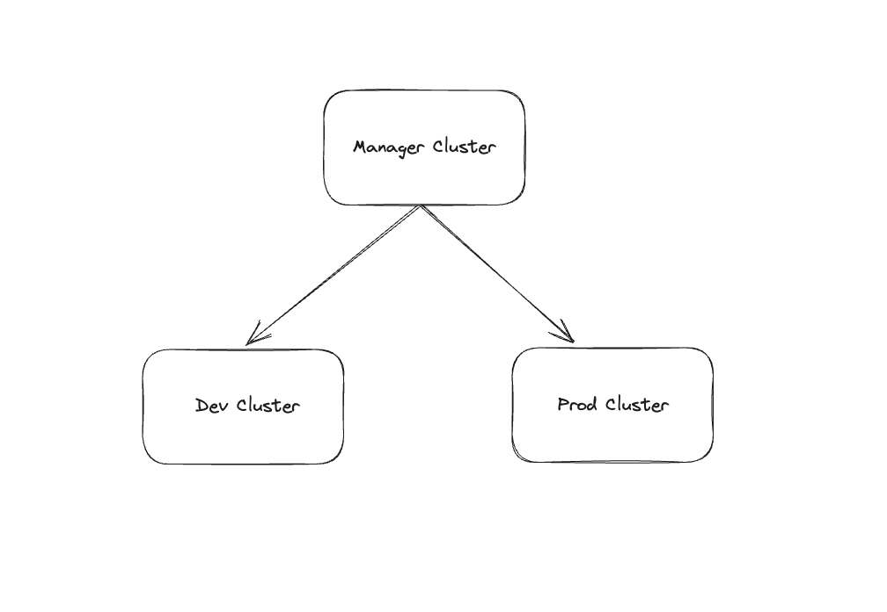

# Kubernetes Cluster Basic Stack

This repository aims to be a basic cluster that can be used almost with 0 config as a fully working environment.

This includes:

- Continuous Deployment
- Monitoring
- Service Mesh
- Cluster Autoscaler
- Network policies best practices
- Typical needs of an AWS based k8s cluster
- ... more to come

## High level overview

- Manager Cluster
  - Contains the ArgoCD that manages the other cluster applications
- Dev Cluster
  - Contains development workload
- Production Cluster
  - Contains production workload

## Continuous Deployment

This cluster uses the [App of Apps pattern](https://argo-cd.readthedocs.io/en/stable/operator-manual/cluster-bootstrapping/#app-of-apps-pattern).

To add a new application to the cluster all you have to do is add an [Application](https://argo-cd.readthedocs.io/en/stable/operator-manual/declarative-setup/#applications) resource and it will added to ArgoCD managed applications.

### TODO:

[X] Create manager cluster
[X] Install argocd
[X] Manage argocd with argocd (argoception)
[] Create dev cluster
[] Deploy application to dev cluster
[] Create production cluster
[] Deploy application to production cluster

#### Monitoring

- TODO: Prometheus should scrape all ServiceMonitors, PodMonitors and Direct. **without the need of labels**
- TODO: Alertmanager should fire an alert when Pods are not scheduling..., kubelet... --> 5 rules seen on LCNF.
- TODO: Send alerts to Slack channel..
- TODO: Use Thanos to store metrics in S3 -> Compact them

#### Networking

- TODO: Install LinkerD
- TODO: Avoid traffic between namespaces (except monitoring) -> ¿LinkerD?
- TODO: Avoid traffic inside namespaces unless configured -> Network Policy

#### Argo CD

- TODO: Create real life like RBAC for ArgoCD:
  - Devs should be able to get, deploy, sync applications they are working on.
  - Deletion should be forbidden.

#### Scaling

- TODO: Install and explore Cluster AutoScaler // Karpenter
- TODO: Explore vertical autoscaler
- TODO: Take a look at cast.ai

#### Certificates

- TODO: Add cert-manager to automatically assign SSL to ingresses

#### External DNS

- TODO: Explore and install external-dns to work with AWS Route 53

#### 10x SRE --> Controllers and CRD

- TODO: Explore the possibility of having a ApplicationDashboard CRD to create Grafana Dashboards
